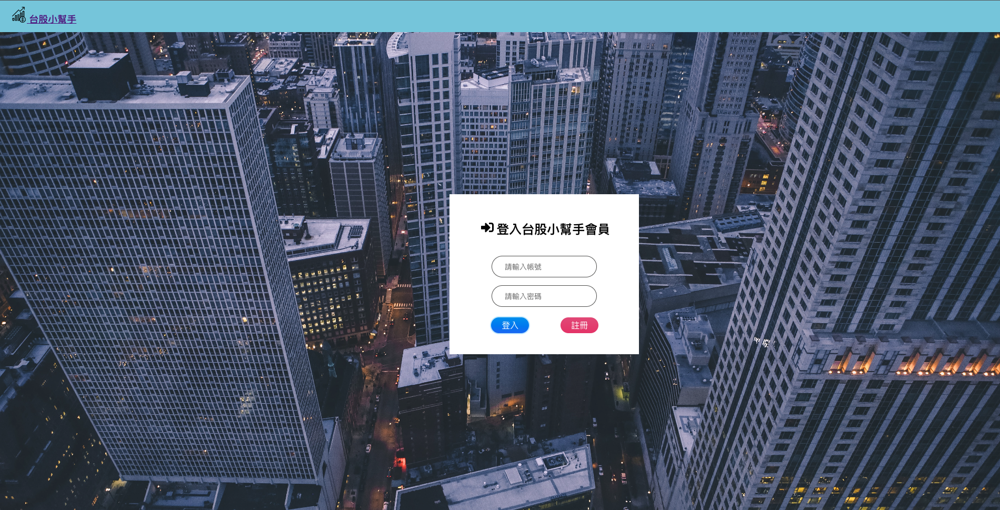
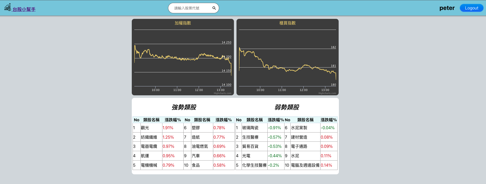
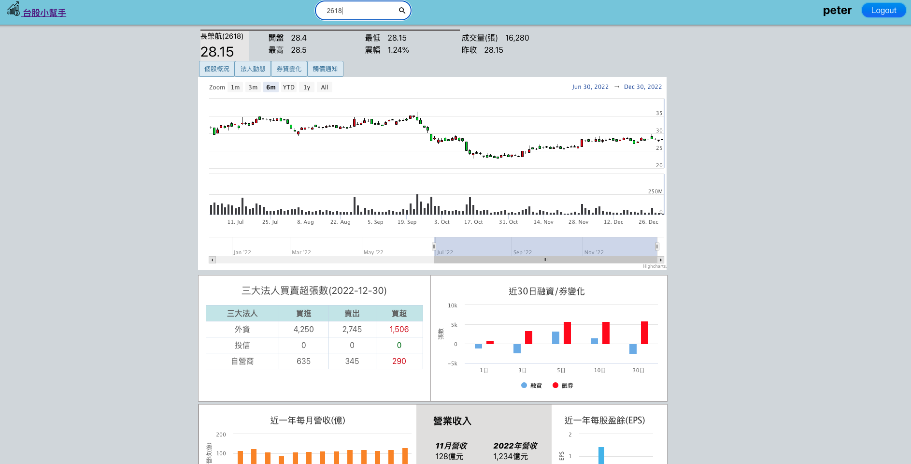
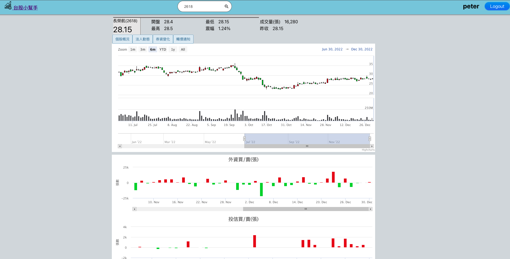
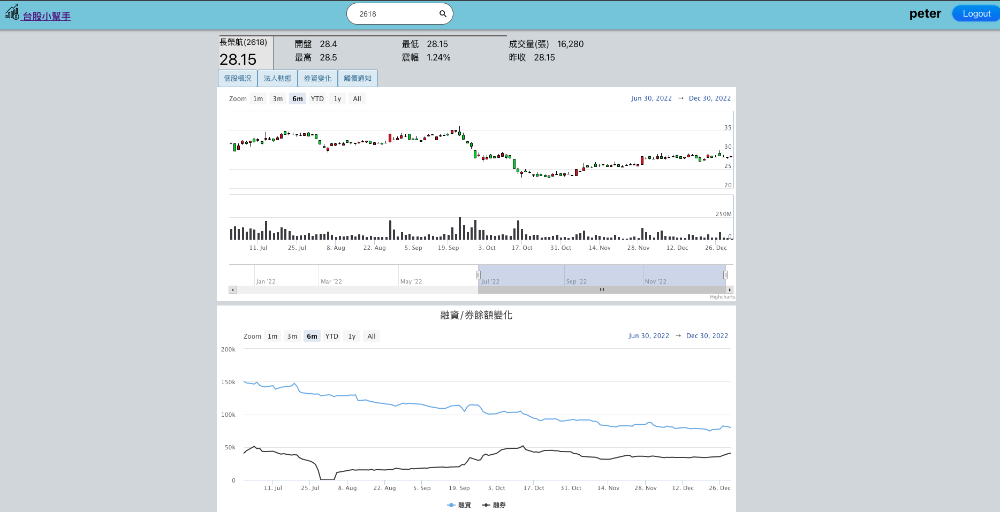
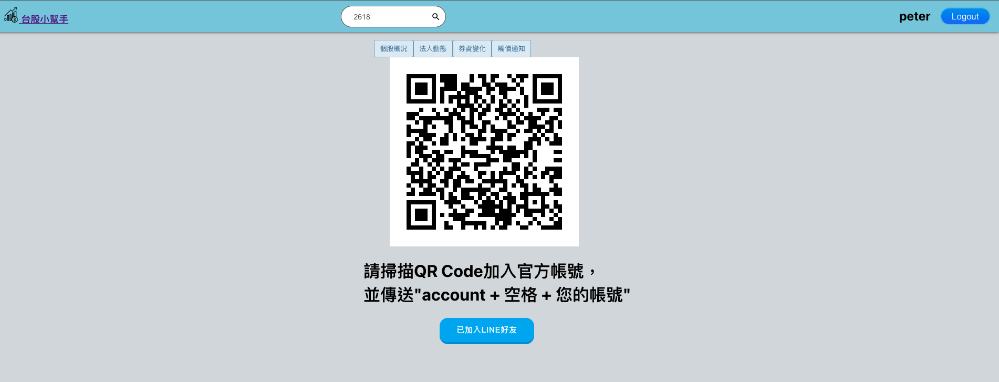
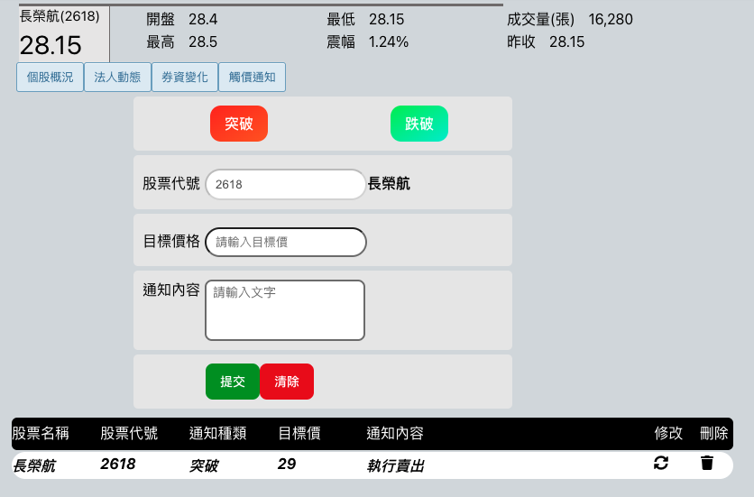
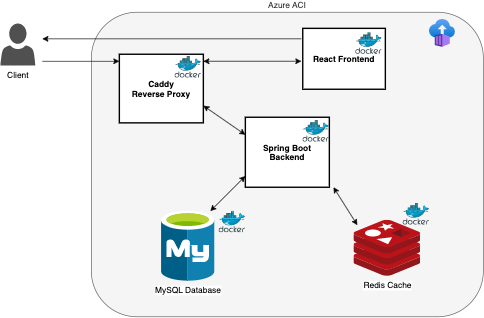

#台股小幫手

##應用程式簡介

`台股小幫手`是一款協助查詢台股大盤及個股多種數據資料、以及串接line bot傳送到價通知及股價查
詢的app，使用前後端分離的架構，前端使用React框架，後端使用Spring Boot框架，並串連
MYSQL資料庫與Redis緩存，最後使用Docker打包並部署至Azure ACI雲服務,
app透過後端串接finmind與富果API取得台股大盤與個股相關資料並轉換為前端需要的資料格式，
當使用者註冊app帳號並加入台股小幫手line官方帳號後，可以設定個股到價通知，也可以透過
line官方帳號設定到價通知、設定個股觀察清單、查詢個股即時股價，後端將串接 linebot API
傳送相關通知．

##專案網址
- 項目網址: <https://twstock.japaneast.azurecontainer.io>
- github clone: <https://github.com/popojk/twstock.git>
- 試用帳號: alex
- 試用密碼: 456

##項目功能介紹
登入畫面

登入首頁

個股資訊查詢首頁

個股法人買賣資訊頁

個股法人買賣資訊頁

個股資券變化資訊頁

個股到價通知頁，第一次使用須用手機掃描QR code加入官方帳號輸入指令後才能使用

##使用技術
###後端:

| 技術                | 用途                |
| ------------------ | ------------------- |
|Spring Boot         |後端框架              |
|Spring Security     |後端JWT權限控管        |
|JPA                 |資料庫ORM             |
|MySql               |後端RDBS資料庫         |
|Redis               |緩存快速取得股票代號/名稱 |
|Swagger             |撰寫API文件             |
|Lombok              |簡化物件工具             |
|Feign               |後端傳送http request至line bot API |

###前端:
| 技術                | 用途                |
| ------------------ | ------------------- |
|React               |前端框架              |
|Redux         |資料管理              |
|npm         |套件管理              |

###部署:
| 技術                | 用途                |
| ------------------ | ------------------- |
|Azure ACI               |將容器化服務部署至Azure ACI     |
|Caddy               |前後端服務反向代理、https設定       |
|Docker              |容器化服務並上傳雲服務          |

##系統架構

